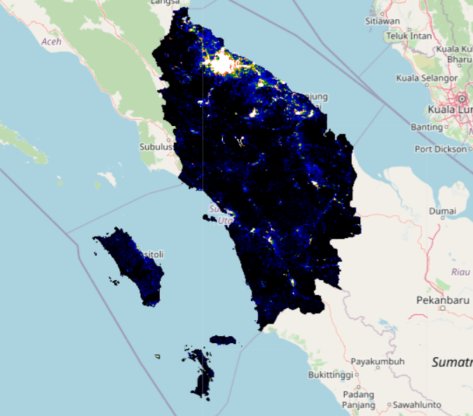
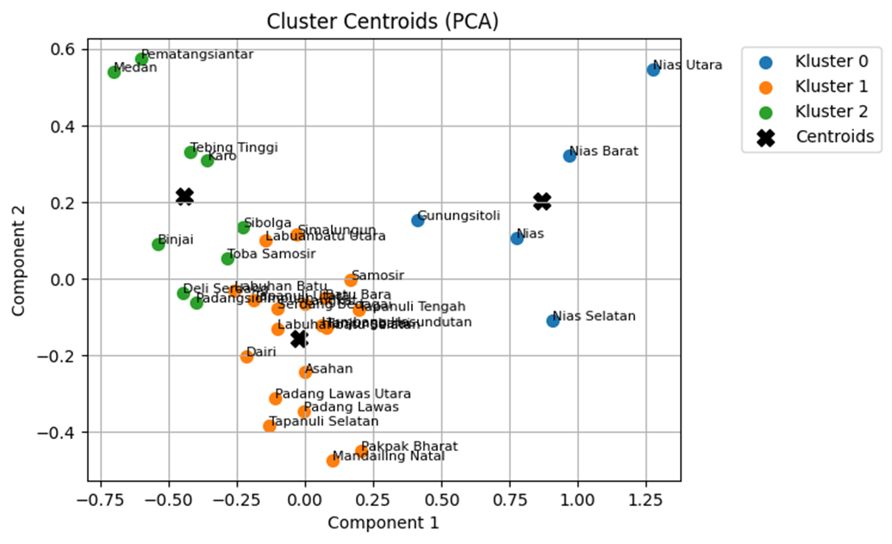
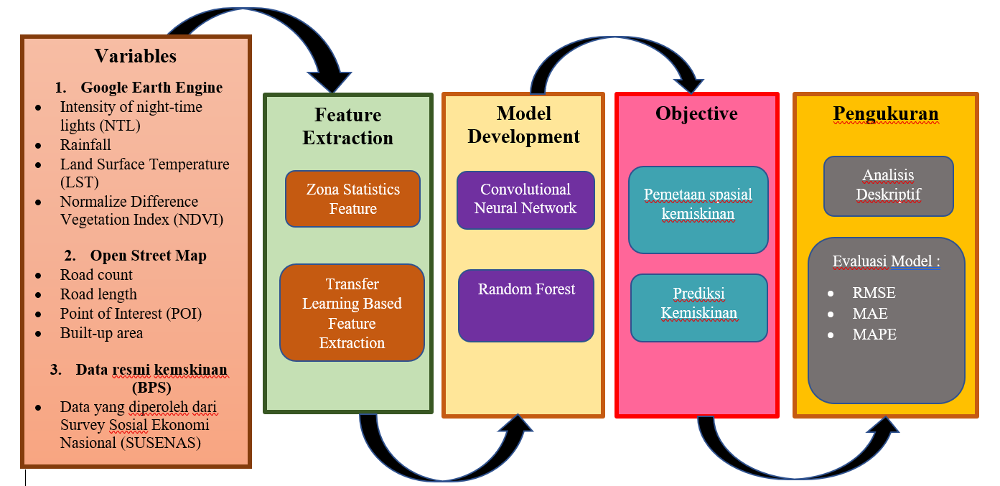

# Multimodal Data Analysis Using Deep Learning Approach for Poverty Detection in North Sumatra Province
Penelitian ini bertujuan untuk melakukan analisis data multimodal dengan pendekatan deep learning guna mendeteksi tingkat kemiskinan di Provinsi Sumatera Utara. Data yang digunakan berasal dari sumber citra satelit dan hasil Survey Sosial Ekonomi Nasional (SUSENAS) yang disediakan oleh Badan Pusat Statistik (BPS). Berikut adalah variabel-variabel yang digunakan dalam penelitian ini:

1. **Nighttime Light Intensity (NTL):** Digunakan untuk mendeteksi distribusi kegiatan ekonomi dengan menggunakan data dari VIIRS.

2. **Normalized Difference Vegetation Index (NDVI):** Digunakan untuk mendeteksi daerah pedesaan berdasarkan tumbuhan dengan menggunakan data dari Sentinel-2.

3. **Built-up Index (BUI):** Digunakan untuk mendeteksi daerah perkotaan berdasarkan distribusi bangunan.

4. **Normalized Difference Water Index (NDWI):** Digunakan untuk mendeteksi tutupan lahan.

5. **Land Surface Temperature (LST):** Digunakan untuk mendeteksi area perkotaan berdasarkan distribusi suhu permukaan dengan menggunakan data dari MODIS.

6. **Carbon Monoxide (CO), Nitrogen Dioxide (NO2), Sulfur Dioxide (SO2):** Digunakan untuk mendeteksi aktivitas ekonomi berdasarkan polusi udara, dengan data berasal dari Sentinel-5P.

7. **POI Density dan POI Minimum Cost:** Mengindikasikan kepadatan kegiatan ekonomi dan aksesibilitas suatu wilayah, dengan data dari Open Street Map.

8. **Rata-rata Kemiskinan Kabupaten dan Kecamatan:** Persentase kemiskinan kabupaten dan kecamatan berdasarkan data SUSENAS.

9. **Estimasi Kepadatan Penduduk:** Tingkat kepadatan penduduk berdasarkan data BPS.

Penelitian ini memiliki fokus pada penggabungan data dari berbagai sumber multimodal, seperti citra satelit dan data survei, serta pemanfaatan pendekatan deep learning dan algoritma machine learning untuk menganalisis dan memprediksi tingkat kemiskinan di Provinsi Sumatera Utara. Selain itu, penelitian ini juga mencakup aspek pembangunan aplikasi berbasis Android dan web interaktif untuk memvisualisasikan hasil prediksi dan identifikasi kemiskinan.

| Hasil Preprocessing Data NTL (VNP46A2)                        |
|------------------------------------|
|  |

| Hasil Klasterisasi Kemiskinan                       | Metode Penelitian                    |
|-------------------------------|-------------------------------|
|  |  |
